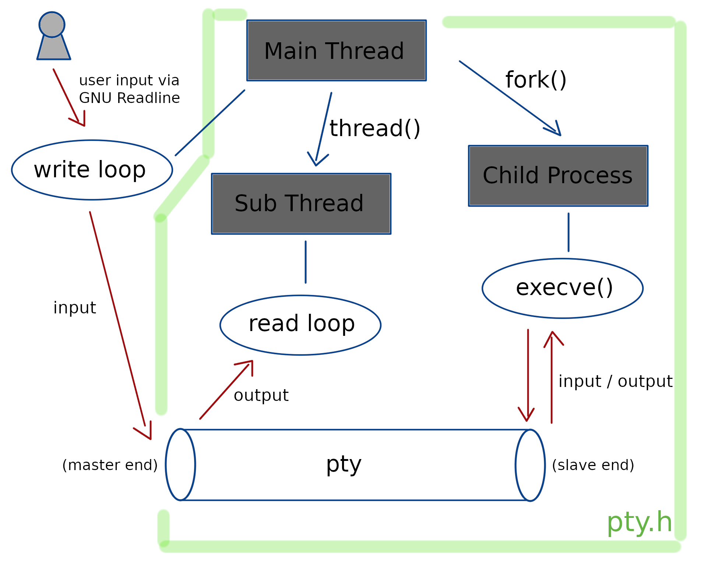

# Rl, a [GNU Readline](https://tiswww.case.edu/php/chet/readline/rltop.html) wrapper for any commands.

## Introduction

### What can `rl` do in a nutshell?

`rl` wraps any commands with GNU Readline Library. With it, you can enjoy highly developed functionality for editing, e.g. vim-like or emacs-like keyboard bindings, tab-completion, command history and so on.

### How is `rl` different from the existing brilliant command `rlwrap`?

Basically `rlwrap` has more functions than `rl`. However, `rlwrap` doesn't support some commands like `wolfram`, which is a command-line interface for `Mathematica` (see [here](https://reference.wolfram.com/language/ref/program/wolfram.html) for the detail), via `ssh`. `rl` is written to work with such commands, and it has a few original functionalities.

`rl` is not a fork of `rlwrap`. It is written from scratch.

### Why use not a pipe but a pty?

In the past, `rl` used a pipe to communicates with commands. However, some commands change their behavior if they detect (using `isatty(3)`) that the file descriptor associated with them doesn't refer to a terminal. For example, `wolfram` command exits right away when `SIGINT` signal is raised if its standard input isn't a terminal, though, when you use the command via a terminal (i.e. without any wrapper), it just suspends the calculation and waits for an additional input by a user to decide whether it should abort or resume calculation, which is (often) more ideal than the former behavior. See [Signal handler not working on process opened via pipe](https://stackoverflow.com/questions/57015738/signal-handler-not-working-on-process-opened-via-pipe) for the detail. So, at some point, the implementation was switched from a pipe to a pty (pseudo-terminal). Note that `rlwrap` also uses a pty.

The program is implemented as shown below.



## Functionality

### Usage

```
~ $ ./rl.out --help
Usage
  rl [<option(s)>] <command> [<option(s) to command>]
  rl {-h|--help}

Options
  --title <title>                      Set the terminal title.
  --dict <file name>                   Use the specified file as a dictionary for tab-completion.
  --special-string-file <file name>    Define special strings from the file.
  --enable-exclamation-command         Execute an input as a shell command if it starts with '!'.
  --rl-output-prefix <prefix>          Set a string which is prepended to the first line of `RlOutput` command's output.
  --first-input <string>               Set a string which is automatically input when the session starts
.
  --comment-char <char>                Set a starting character of a comment line.
  --help,-h                            Print this help message.

Special Commands
  RlOutput      Output to standard output every string which was input in this session.
  RlSave        Same as above, but output to a file (additional input of the file name is required).
  RlRestart     Restart the session.
```

Even with no option, you can use full features of GNU Readline.

### Special Commands

`rl` interprets some sorts of user inputs.

- `RlOutput`

Output to standard output every string which was input in this session.

- `RlSave`

Same as `RlOutput`, but output to a file. An additional input of the file name is required. Independent of this command, the input history is always appended to a certain file. See the [**Files**](#files) section for the detail.

- `RlRestart`

Restart the session. Internally, this gracefully kills all relevant thread and process to restart them. This is useful for example when you use an interactive calculator which has no function to undefine all variables you've defined in this session but you still want to undefine them without restarting `rl`.

Example of special commands:

```
~ $ ./rl.out python3 -q

> 1 + 1
2

> 3 * 5
15

> RlOutput
----Input History----
1 + 1
3 * 5
----------------

RlSave
Output File: log
rl: Input history has been output to [ log ].

> a = 3

> RlRestart
Restarting the session...

------------------------------------------------------

> a
Traceback (most recent call last):
  File "<stdin>", line 1, in <module>
NameError: name 'a' is not defined

~ $ cat log
1 + 1
3 * 5
```

### Options

* `--title <title>`

Set the terminal title. The word *terminal* here is irrelevant to the pty used by `rl`. It refers to the terminal in which you execute `rl`.

* `--dict <file name>`

Use the specified file as a dictionary for tab-completion. The file should contain one string per line. Example:
```
~ $ cat dict_for_wolfram.txt
Abs
Apart
Append
Apply
ArcCos
...
Unprotect
UpperTriangularMatrixQ
VectorAngle
VectorQ
While
```

There is no problem if the file isn't sorted.

- `--special-string-file <file name>`

Define special strings from the file. The file should contain one definition per line which is of the form `<alias> <command>` where `<alias>` doesn't contain white spaces. When you input `<alias>`, `rl` interprets it not as a normal input to the connected command but as a special command and execute `<command>` as a shell command. Example:
```
~ $ cat special_string_list.txt
ll ls -la
what_time date +'%Y/%m/%d(%a) %H:%M:%S'

~ $ ./rl.out --special-string-file "./special_string_list.txt" ssh ${user}@${ip} /usr/bin/wolfram
Mathematica 12.0.1 Kernel for Linux ARM (32-bit)
Copyright 1988-2019 Wolfram Research, Inc.

In[1]:= 3 * 5

Out[1]= 15

In[2]:= ll
total 304
drwxr-xr-x 5 usr grp   4096 Nov 24 20:40 .
drwxr-xr-x 4 usr grp   4096 Nov 24 19:15 ..
-rw-r--r-- 1 usr grp    541 Nov 24 17:39 1.cpp
-rwxr-xr-x 1 usr grp  62352 Nov 24 18:31 1.out
...

In[2]:= what_time
2019/11/24(Sun) 20:41:47

In[2]:= 1 + 1

Out[2]= 2
```

- `--enable-exclamation-command`

Execute an input as a shell command if it starts with an exclamation mark (!). Example:
```
~ $ ./rl.out --enable-exclamation-command python3 -q
> 1 + 1
2

> !echo hello
hello

> 3 * 5
15
```

- `--rl-output-prefix <prefix>`

Set a string which is prepended to the first line of `RlOutput` command's output. Example:
```
~ $ ./rl.out --rl-output-prefix "#This is a log." python3 -q

> 1 + 1
2

> 3 + 4
7

> RlOutput
----Input History----
#This is a log.
1 + 1
3 + 4
----------------
```

- `--first-input <string>`

Set a string which is automatically input when the session starts. Currently, this option can be specified only once. This design should be changed in the future.

- `--comment-char <char>`

Set a starting character of a comment line. If a user input starts with `<char>`, `rl` just ignores it. Note that `<char>` must be the first character of the line (i.e. comment in the middle of a line isn't supported). Example:
```
~ $ ./rl.out --comment-char '/' python3 -q

> /a = 3

> a
Traceback (most recent call last):
  File "<stdin>", line 1, in <module>
NameError: name 'a' is not defined
```

- `-h`, `--help`

Output a usage message and exit.

### Files

- `~/.inputrc`

An initialization file for GNU Readline. This file is used by all the applications (e.g. `bash`) which use Readline library. Example:
```
~ $ cat ~/.inputrc
#This setting is global.
set editing-mode vi

#This setting is local to `rl`
$if Rl
    set blink-matching-paren
$endif
```

- `~/.rl_history/<command name>`

Input history of `rl`. At the start of a session, this file is automatically loaded. At the end of a session, all the inputs are appended to this file. Currently, there is no support for changing the path of this file, other than modifying a single line of the source code. If you follow all of examples above, you get `~/.rl_history/python3` and `~/.rl_history/ssh`.

## Installation

### Requirement

- Linux

- [GNU Readline Library](https://tiswww.case.edu/php/chet/readline/rltop.html)

- [g++](https://gcc.gnu.org/)

- [GNU Make](https://www.gnu.org/software/make/)

### Build & Installation

- `make`

Build the program. 

- `make debug`

Same as `make` but with debug options.

- `make clean`

Remove all files created in the process of building the program. This operation doesn't remove the installed binary file. So doing this doesn't mean you cannot use `rl` any longer.

- `make prefix=<prefix> install`

Install the program under `<prefix>`. For the safety, `<prefix>` cannot be omitted.

- `make prefix=<prefix> uninstall`

Uninstall the installed program. This is completely irrelevant to `make clean`.

